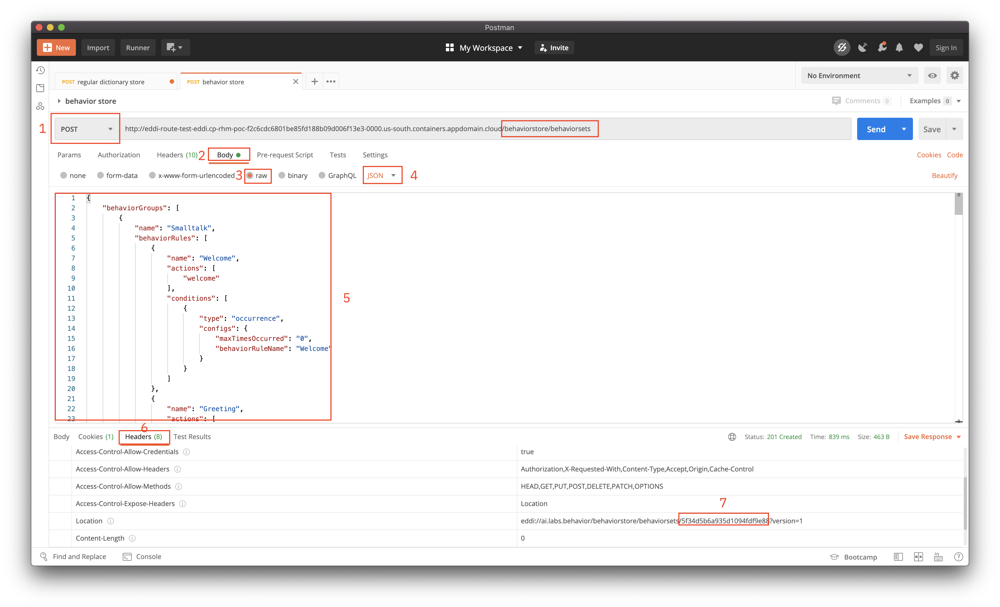

---
#Front matter (metadata).
abstract:               # REQUIRED

authors:
 - name: "Manoj Jahgirdar"
   email: "manoj.jahgirdar@in.ibm.com"
 - name: "Srikanth Manne"
   email: "srikanth.manne@in.ibm.com"
 - name: "Rahul Reddy Ravipally"
   email: "raravi86@in.ibm.com"
 - name: "Manjula G. Hosurmath"
   email: "mhosurma@in.ibm.com"

completed_date: 2020-01-20

components:
- slug: "eddi-operator"
  name: "E.D.D.I Operator"
  url: "https://marketplace.redhat.com/en-us/products/labsai"
  type: "component"
- slug: "redhat-marketplace"
  name: "Red Hat Marketplace"
  url: "https://marketplace.redhat.com/"
  type: "component"

draft: true|false       # REQUIRED

excerpt:                # REQUIRED

keywords:               # REQUIRED - comma separated list

last_updated:           # REQUIRED - Note: date format is YYYY-MM-DD

primary_tag:          # REQUIRED - Note: Choose only only one primary tag. Multiple primary tags will result in automation failure. Additional non-primary tags can be added below.

pta:                    # REQUIRED - Note: can be only one
# For a full list of options see https://github.ibm.com/IBMCode/Definitions/blob/master/primary-technology-area.yml
# Use the "slug" value found at the link above to include it in this content.
# Example (remove the # to uncomment):
 # - "cloud, container, and infrastructure"

pwg:                    # REQUIRED - Note: can be one or many
# For a full list of options see https://github.ibm.com/IBMCode/Definitions/blob/master/portfolio-working-group.yml
# Use the "slug" value found at the link above to include it in this content.
# Example (remove the # to uncomment):
# - "containers"

related_content:        # OPTIONAL - Note: zero or more related content
  - type: announcements|articles|blogs|patterns|series|tutorials|videos
    slug:

related_links:           # OPTIONAL - Note: zero or more related links
  - title:
    url:
    description:

runtimes:               # OPTIONAL - Note: Select runtimes from the complete set of runtimes below. Do not create new runtimes. Only use runtimes specifically in use by your content.
# For a full list of options see https://github.ibm.com/IBMCode/Definitions/blob/master/runtimes.yml
# Use the "slug" value found at the link above to include it in this content.
# Example (remove the # to uncomment):
 # - "asp.net 5"

series:                 # OPTIONAL
 - type:
   slug:

services:               # OPTIONAL - Note: please select services from the complete set of services below. Do not create new services. Only use services specifically in use by your content.
# For a full list of options see https://github.ibm.com/IBMCode/Definitions/blob/master/services.yml
# Use the "slug" value found at the link above to include it in this content.
# Example (remove the # to uncomment):
# - "blockchain"

subtitle:               # REQUIRED

tags:
# Please select tags from the complete set of tags below. Do not create new tags. Only use tags specifically targeted for your content. If your content could match all tags (for example cloud, hybrid, and on-prem) then do not tag it with those tags. Less is more.
# For a full list of options see https://github.ibm.com/IBMCode/Definitions/blob/master/tags.yml
# Use the "slug" value found at the link above to include it in this content.
# Example (remove the # to uncomment):
 # - "blockchain"

title:                  # REQUIRED

translators:             # OPTIONAL - Note: can be one or more
  - name:
    email:

type: tutorial

---

# Build a Risk of Covid-19 Infection assessment chatbot using E.D.D.I hosted on Red Hat Marketplace.

In this tutorial, we will learn how to build a chatbot that will assess your risk of getting infected with Covid-19 using E.D.D.I Operator hosted on Red Hat Marketplace.

# About E.D.D.I Operator

E.D.D.I is an Enterprise-Ready Chatbot Platform for creating, running and maintaining customizable chatbots. It Scales Out very well due to resource-oriented design & RESTful architecture. It has NLP Parser for matching user inputs as words and phrases even in case of spelling mistakes or missing spaces between words. It also has Behavior Rules for making decisions with predefined and custom conditions. [Learn more](https://marketplace.redhat.com/en-us/products/labsai).

# Learning objectives

When you have completed this tutorial, you will understand how to:

* Install E.D.D.I Operator from Red Hat Marketplace on a OpenShift Cluster
* Create an E.D.D.I chatbot instance
* Build a chatbot from scratch with E.D.D.I Operator

# Estimated time

Completing this tutorial should take about 30 minutes.

# Pre-requisites

1. [Red Hat Marketplace Account](https://marketplace.redhat.com/en-us/registration/om).
2. [Red Hat OpenShift Cluster](https://cloud.ibm.com/kubernetes/catalog/create?platformType=openshift). 
3. [OC & kubectl CLI](https://docs.openshift.com/container-platform/3.6/cli_reference/get_started_cli.html).

# Steps

### Step 1: Install the E.D.D.I Operator from Red Hat Marketplace on OpenShift Cluster

- Steps to Deploy E.D.D.I Operator from Red Hat Marketplace on a OpenShift Cluster can be found here,
  - [Steps to Deploy E.D.D.I Operator](https://github.com/IBM/rhm-eddi-operator-deployment-steps)

- Once you have successfully setup E.D.D.I Operator on OpenShift Cluster you will get an `URL` to access the E.D.D.I dashboard, make a note of the `URL` as it will be used in subsequent steps.

### Step 2: Create a chatbot in E.D.D.I

- Now, let's create a chatbot in E.D.D.I from scratch.

- The steps involved in creating a chatbot are as follows:
    - Create a `Regular Dictionary`
    - Create `Behavior Rules`
    - Create `Output sets`
    - `Packaging` it
    - Create a `bot`

- In order to build a Chatbot with E.D.D.I, you will have to create a few configuration files and POST them to the corresponding REST APIs. You can use tools like [Postman](https://www.postman.com/downloads/) to make the API calls.

#### Step 2.1: Create Regular Dictionary

- We create regular dictionaries in order to store custom words and phrases.

- Make a `POST` to `<eddi-url>/regulardictionarystore/regulardictionaries` with a JSON in the body as follows.

>NOTE: You will have the `<eddi-url>` generated in [step 1](#step-1-install-the-eddi-operator-from-red-hat-marketplace-on-openshift-cluster).

- In Postman, enter the `<eddi-url>` followed by `/regulardictionarystore/regulardictionaries`, make sure you select the following parameters:
    1. Select the request type to be `POST`
    2. Select `Body`
    3. Select `raw`
    4. Select type as `JSON`
    5. Copy and paste the JSON body given below
    ```json
    {
        "words": [
            {
                "word": "hello",
                "expressions": "greeting(hello)",
                "frequency": 0
            },
            {
                "word": "hi",
                "expressions": "greeting(hi)",
                "frequency": 0
            },
            {
                "word": "bye",
                "expressions": "goodbye(bye)",
                "frequency": 0
            },
            {
                "word": "take test",
                "expressions": "taketest(yes)",
                "frequency": 0
            },
            {
                "word": "thanks",
                "expressions": "thanks(thanks)",
                "frequency": 0
            }
        ],
        "regExs": [],
        "phrases": [
            {
                "phrase": "good afternoon",
                "expressions": "greeting(good_afternoon)"
            },
            {
                "phrase": "how are you",
                "expressions": "how_are_you"
            }
        ]
    }
    ```
    - Click on `Send` button to make request
    - On successful request you can see a status: `201 Created` in your postman
    6. Click on the `Headers` to view the response
    7. You can see a `Location` header with a URL something like `eddi://ai.labs.regulardictionary/regulardictionarystore/regulardictionaries/<UNIQUE_DICTIONARY_ID>?version=<UNIQUE_DICTIONARY_VERSION>`. Make a note of the `<UNIQUE_DICTIONARY_ID>` as shown. 


>Note: The `<UNIQUE_DICTIONARY_ID>` will be used in Packaging, please make a note of it.

#### Step 2.2: Create Behavior Rules

- Behavior Rules are Actions based on decision making with predefined as well as custom conditions.

- Make a `POST` to `<eddi-url>/behaviorstore/behaviorsets` with a JSON in the body as follows.

>NOTE: You will have the `<eddi-url>` generated in [step 1](#step-1-install-the-eddi-operator-from-red-hat-marketplace-on-openshift-cluster).

- In Postman, enter the `<eddi-url>` followed by `/behaviorstore/behaviorsets`, make sure you select the following parameters:
    1. Select the request type to be `POST`
    2. Select `Body`
    3. Select `raw`
    4. Select type as `JSON`
    5. Copy and paste the JSON body given below
    ```json
    {
        "behaviorGroups": [
            {
                "name": "Smalltalk",
                "behaviorRules": [
                    {
                        "name": "Welcome",
                        "actions": [
                            "welcome"
                        ],
                        "conditions": [
                            {
                                "type": "occurrence",
                                "configs": {
                                    "maxTimesOccurred": "0",
                                    "behaviorRuleName": "Welcome"
                                }
                            }
                        ]
                    },
                    {
                        "name": "Greeting",
                        "actions": [
                            "greet"
                        ],
                        "conditions": [
                            {
                                "type": "inputmatcher",
                                "configs": {
                                    "expressions": "greeting(*)",
                                    "occurrence": "currentStep"
                                }
                            }
                        ]
                    },
                    {
                        "name": "Taketest",
                        "actions": [
                            "taketest"
                        ],
                        "conditions": [
                            {
                                "type": "inputmatcher",
                                "configs": {
                                    "expressions": "taketest(*)",
                                    "occurrence": "currentStep"
                                }
                            }
                        ]
                    },
                    {
                        "name": "Symptom 1",
                        "actions": [
                            "symptomone",
                            "CONVERSATION_END"
                        ],
                        "conditions": [
                            {
                                "type": "inputmatcher",
                                "configs": {
                                    "expressions": "symptomone(*)",
                                    "occurrence": "currentStep"
                                }
                            }
                        ]
                    },
                    {
                        "name": "Safe",
                        "actions": [
                            "safe",
                            "CONVERSATION_END"
                        ],
                        "conditions": [
                            {
                                "type": "inputmatcher",
                                "configs": {
                                    "expressions": "safe(*)",
                                    "occurrence": "currentStep"
                                }
                            }
                        ]
                    },
                    {
                        "name": "Semi Safe",
                        "actions": [
                            "semisafe",
                            "CONVERSATION_END"
                        ],
                        "conditions": [
                            {
                                "type": "inputmatcher",
                                "configs": {
                                    "expressions": "semisafe(*)",
                                    "occurrence": "currentStep"
                                }
                            }
                        ]
                    },
                    {
                        "name": "Semi Risk",
                        "actions": [
                            "semirisk",
                            "CONVERSATION_END"
                        ],
                        "conditions": [
                            {
                                "type": "inputmatcher",
                                "configs": {
                                    "expressions": "semirisk(*)",
                                    "occurrence": "currentStep"
                                }
                            }
                        ]
                    },
                    {
                        "name": "Symptom 2",
                        "actions": [
                            "symptomtwo"
                        ],
                        "conditions": [
                            {
                                "type": "inputmatcher",
                                "configs": {
                                    "expressions": "symptomtwo(*)",
                                    "occurrence": "currentStep"
                                }
                            }
                        ]
                    },
                    {
                        "name": "Symptom 2a",
                        "actions": [
                            "symptomtwoa"
                        ],
                        "conditions": [
                            {
                                "type": "inputmatcher",
                                "configs": {
                                    "expressions": "symptomtwoa(*)",
                                    "occurrence": "currentStep"
                                }
                            }
                        ]
                    },
                    {
                        "name": "Symptom 2b",
                        "actions": [
                            "symptomtwob"
                        ],
                        "conditions": [
                            {
                                "type": "inputmatcher",
                                "configs": {
                                    "expressions": "symptomtwob(*)",
                                    "occurrence": "currentStep"
                                }
                            }
                        ]
                    },
                    {
                        "name": "Symptom 2c",
                        "actions": [
                            "symptomtwoc"
                        ],
                        "conditions": [
                            {
                                "type": "inputmatcher",
                                "configs": {
                                    "expressions": "symptomtwoc(*)",
                                    "occurrence": "currentStep"
                                }
                            }
                        ]
                    },
                    {
                        "name": "Symptom 3",
                        "actions": [
                            "symptomthree"
                        ],
                        "conditions": [
                            {
                                "type": "inputmatcher",
                                "configs": {
                                    "expressions": "symptomthree(*)",
                                    "occurrence": "currentStep"
                                }
                            }
                        ]
                    },
                    {
                        "name": "Goodbye",
                        "actions": [
                            "say_goodbye",
                            "CONVERSATION_END"
                        ],
                        "conditions": [
                            {
                                "type": "inputmatcher",
                                "configs": {
                                    "expressions": "goodbye(*)"
                                }
                            }
                        ]
                    },
                    {
                        "name": "Thank",
                        "actions": [
                            "thank"
                        ],
                        "conditions": [
                            {
                                "type": "inputmatcher",
                                "configs": {
                                    "expressions": "thank(*)"
                                }
                            }
                        ]
                    },
                    {
                        "name": "how are you",
                        "actions": [
                            "how_are_you"
                        ],
                        "conditions": [
                            {
                                "type": "inputmatcher",
                                "configs": {
                                    "expressions": "how_are_you"
                                }
                            }
                        ]
                    }
                ]
            }
        ]
    }
    ```
    - Click on `Send` button to make request
    - On successful request you can see a status: `201 Created` in your postman
    6. Click on the `Headers` to view the response
    7. You can see a `Location` header with a URL something like `eddi://ai.labs.behavior/behaviorstore/behaviorsets/<UNIQUE_BEHAVIOR_ID>?version=<BEHAVIOR_VERSION>`. Make a note of the `<UNIQUE_BEHAVIOR_ID>` as shown. 



>Note: The `<UNIQUE_BEHAVIOR_ID>` will be used in Packaging, please make a note of it.

#### Step 2.3: Create Output Sets

- Output is defined to answer the users request based on the results from the behavior rule execution.

- Make a `POST` to `<eddi-url>/outputstore/outputsets` with a JSON in the body as follows.

>NOTE: You will have the `<eddi-url>` generated in [step 1](#step-1-install-the-eddi-operator-from-red-hat-marketplace-on-openshift-cluster).

- In Postman, enter the `<eddi-url>` followed by `/outputstore/outputsets`, make sure you select the following parameters:
    1. Select the request type to be `POST`
    2. Select `Body`
    3. Select `raw`
    4. Select type as `JSON`
    5. Copy and paste the JSON body given below
    ```json
    {
        "outputSet": [
            {
                "action": "welcome",
                "timesOccurred": 0,
                "outputs": [
                    {
                        "type": "text",
                        "valueAlternatives": [
                            "Hi!, I am COVID-19 Chatbot"
                        ]
                    },
                    {
                        "type": "text",
                        "valueAlternatives": [
                            "Visit https://www.mohfw.gov.in/ to get more information regarding COVID-19 in India"
                        ]
                    },
                    {
                        "type": "text",
                        "valueAlternatives": [
                            "I will assess you today!"
                        ]
                    }
                ],
                "quickReplies": [
                    {
                        "value": "Sounds Good!",
                        "expressions": "taketest(yes)"
                    },
                    {
                        "value": "No Thanks I'm Fine.",
                        "expressions": "goodbye(bye)"
                    }
                ]
            },
            {
                "action": "greet",
                "timesOccurred": 0,
                "outputs": [
                    {
                        "type": "text",
                        "valueAlternatives": [
                            "Hi there! Nice to meet up! :-)",
                            "Hey you!"
                        ]
                    }
                ],
                "quickReplies": []
            },
            {
                "action": "taketest",
                "timesOccurred": 0,
                "outputs": [
                    {
                        "type": "text",
                        "valueAlternatives": [
                            "Are you experiencing any of the following symptoms?"
                        ]
                    },
                    {
                        "type": "text",
                        "valueAlternatives": [
                            "• severe difficulty breathing (for example, struggling for each breath, speaking in single words) \n • severe chest pain \n • having a very hard time waking up \n • feeling confused \n • lost consciousness"
                        ]
                    }
                ],
                "quickReplies": [
                    {
                        "value": "YES",
                        "expressions": "symptomone(yes)"
                    },
                    {
                        "value": "NO",
                        "expressions": "symptomtwo(yes)"
                    }
                ]
            },
            {
                "action": "symptomone",
                "timesOccurred": 0,
                "outputs": [
                    {
                        "type": "text",
                        "valueAlternatives": [
                            "Self-assessment result: AT RISK!"
                        ]
                    },
                    {
                        "type": "text",
                        "valueAlternatives": [
                            "Please call 104 or 97456-97456 Immediately"
                        ]
                    }
                ],
                "quickReplies": []
            },
            {
                "action": "symptomtwo",
                "timesOccurred": 0,
                "outputs": [
                    {
                        "type": "text",
                        "valueAlternatives": [
                            "Are you experiencing any of the following symptoms (or a combination of these symptoms)?"
                        ]
                    },
                    {
                        "type": "text",
                        "valueAlternatives": [
                            "• fever \n • new cough \n • difficulty breathing (for example, struggling for each breath, cannot hold breath for more than 10 seconds)"
                        ]
                    }
                ],
                "quickReplies": [
                    {
                        "value": "YES",
                        "expressions": "symptomtwoa(yes)"
                    },
                    {
                        "value": "NO",
                        "expressions": "symptomthree(yes)"
                    }
                ]
            },
            {
                "action": "symptomtwoa",
                "timesOccurred": 0,
                "outputs": [
                    {
                        "type": "text",
                        "valueAlternatives": [
                            "Have you travelled outside of India in the last 1 Month?"
                        ]
                    }
                ],
                "quickReplies": [
                    {
                        "value": "YES",
                        "expressions": "semirisk(yes)"
                    },
                    {
                        "value": "NO",
                        "expressions": "symptomtwob(yes)"
                    }
                ]
            },
            {
                "action": "symptomtwob",
                "timesOccurred": 0,
                "outputs": [
                    {
                        "type": "text",
                        "valueAlternatives": [
                            "Does someone you are in close contact with have COVID-19 (for example, someone in your household or workplace)?"
                        ]
                    }
                ],
                "quickReplies": [
                    {
                        "value": "YES",
                        "expressions": "semirisk(yes)"
                    },
                    {
                        "value": "NO",
                        "expressions": "symptomtwoc(yes)"
                    }
                ]
            },
            {
                "action": "symptomtwoc",
                "timesOccurred": 0,
                "outputs": [
                    {
                        "type": "text",
                        "valueAlternatives": [
                            "Are you in close contact with a person who is sick with respiratory symptoms (for example, fever, cough or difficulty breathing) who recently travelled outside of India?"
                        ]
                    }
                ],
                "quickReplies": [
                    {
                        "value": "YES",
                        "expressions": "semirisk(yes)"
                    },
                    {
                        "value": "NO",
                        "expressions": "semisafe(yes)"
                    }
                ]
            },
            {
                "action": "symptomthree",
                "timesOccurred": 0,
                "outputs": [
                    {
                        "type": "text",
                        "valueAlternatives": [
                            "Are you experiencing any of the following symptoms (or a combination of these symptoms)?"
                        ]
                    },
                    {
                        "type": "text",
                        "valueAlternatives": [
                            "• muscle aches \n • fatigue \n • headache \n • sore throat \n • runny nose"
                        ]
                    }
                ],
                "quickReplies": [
                    {
                        "value": "YES",
                        "expressions": "symptomtwoa(yes)"
                    },
                    {
                        "value": "NO",
                        "expressions": "safe(yes)"
                    }
                ]
            },
            {
                "action": "safe",
                "timesOccurred": 1,
                "outputs": [
                    {
                        "type": "text",
                        "valueAlternatives": [
                            "Self-assessment result: SAFE"
                        ]
                    },
                    {
                        "type": "text",
                        "valueAlternatives": [
                            "It is unlikely that you have COVID-19."
                        ]
                    }
                ],
                "quickReplies": []
            },
            {
                "action": "semisafe",
                "timesOccurred": 1,
                "outputs": [
                    {
                        "type": "text",
                        "valueAlternatives": [
                            "Self-assessment result: MOSTLY SAFE"
                        ]
                    },
                    {
                        "type": "text",
                        "valueAlternatives": [
                            "It is unlikely that you have COVID-19 but you should self-isolate at home until you are symptom-free."
                        ]
                    }
                ],
                "quickReplies": []
            },
            {
                "action": "semirisk",
                "timesOccurred": 1,
                "outputs": [
                    {
                        "type": "text",
                        "valueAlternatives": [
                            "Self-assessment result: MOSTLY AT RISK"
                        ]
                    },
                    {
                        "type": "text",
                        "valueAlternatives": [
                            "Please seek clinical assessment for COVID-19 over the phone."
                        ]
                    }
                ],
                "quickReplies": []
            },
            {
                "action": "greet",
                "timesOccurred": 1,
                "outputs": [
                    {
                        "type": "text",
                        "valueAlternatives": [
                            "Did we already say hi ?! Well, twice is better than not at all! ;-)"
                        ]
                    }
                ],
                "quickReplies": []
            },
            {
                "action": "say_goodbye",
                "timesOccurred": 0,
                "outputs": [
                    {
                        "type": "text",
                        "valueAlternatives": [
                            "See you soon!"
                        ]
                    }
                ],
                "quickReplies": []
            },
            {
                "action": "thank",
                "timesOccurred": 0,
                "outputs": [
                    {
                        "type": "text",
                        "valueAlternatives": [
                            "Your Welcome!"
                        ]
                    }
                ],
                "quickReplies": []
            },
            {
                "action": "how_are_you",
                "timesOccurred": 0,
                "outputs": [
                    {
                        "type": "text",
                        "valueAlternatives": [
                            "Pretty good.. having lovely conversations all day long.. :-D"
                        ]
                    }
                ],
                "quickReplies": []
            }
        ]
    }
    ```
    - Click on `Send` button to make request
    - On successful request you can see a status: `201 Created` in your postman
    6. Click on the `Headers` to view the response
    7. You can see a `Location` header with a URL something like `eddi://ai.labs.output/outputstore/outputsets/<UNIQUE_OUTPUTSET_ID>?version=<OUTPUTSET_VERSION>`. Make a note of the `<UNIQUE_OUTPUTSET_ID>` as shown. 


>Note: The `<UNIQUE_OUTPUTSET_ID>` will be used in Packaging, please make a note of it.

#### Step 2.4: Packaging

- Now we will align the just created `Tasks` in the Package.

- Make a `POST` to `<eddi-url>/packagestore/packages` with a JSON in the body as follows.

>NOTE: You will have the `<eddi-url>` generated in [step 1](#step-1-install-the-eddi-operator-from-red-hat-marketplace-on-openshift-cluster).

- In Postman, enter the `<eddi-url>` followed by `/packagestore/packages`, make sure you select the following parameters:
    1. Select the request type to be `POST`
    2. Select `Body`
    3. Select `raw`
    4. Select type as `JSON`
    5. Copy and paste the JSON body given below replacing it with the `<UNIQUE_DICTIONARY_ID>`, `<UNIQUE_BEHAVIOR_ID>` and `<UNIQUE_OUTPUTSET_ID>` copied from step 2.1, step 2.2 and step 2.3
    ```json
    {
    "packageExtensions": [
        {
        "type": "eddi://ai.labs.parser",
        "extensions": {
            "dictionaries": [
            {
                "type": "eddi://ai.labs.parser.dictionaries.integer"
            },
            {
                "type": "eddi://ai.labs.parser.dictionaries.decimal"
            },
            {
                "type": "eddi://ai.labs.parser.dictionaries.punctuation"
            },
            {
                "type": "eddi://ai.labs.parser.dictionaries.email"
            },
            {
                "type": "eddi://ai.labs.parser.dictionaries.time"
            },
            {
                "type": "eddi://ai.labs.parser.dictionaries.ordinalNumber"
            },
            {
                "type": "eddi://ai.labs.parser.dictionaries.regular",
                "config": {
                "uri": "eddi://ai.labs.regulardictionary/regulardictionarystore/regulardictionaries/<UNIQUE_DICTIONARY_ID>?version=<DICTIONARY_VERSION>"
                }
            }
            ],
            "corrections": [
            {
                "type": "eddi://ai.labs.parser.corrections.stemming",
                "config": {
                "language": "english",
                "lookupIfKnown": "false"
                }
            },
            {
                "type": "eddi://ai.labs.parser.corrections.levenshtein",
                "config": {
                "distance": "2"
                }
            },
            {
                "type": "eddi://ai.labs.parser.corrections.mergedTerms"
            }
            ]
        },
        "config": {}
        },
        {
        "type": "eddi://ai.labs.behavior",
        "config": {
            "uri": "eddi://ai.labs.behavior/behaviorstore/behaviorsets/<UNIQUE_BEHAVIOR_ID>?version=<BEHAVIOR_VERSION>"
        }
        },
        {
        "type": "eddi://ai.labs.output",
        "config": {
            "uri": "eddi://ai.labs.output/outputstore/outputsets/<UNIQUE_OUTPUTSET_ID>?version=<OUTPUTSET_VERSION>"
        }
        }
    ]
    }
    ```
    - Click on `Send` button to make request
    - On successful request you can see a status: `201 Created` in your postman
    6. Click on the `Headers` to view the response
    7. You can see a `Location` header with a URL something like `eddi://ai.labs.package/packagestore/packages/<UNIQUE_PACKAGE_ID>?version=<PACKAGE_VERSION>`. Make a note of the `<UNIQUE_PACKAGE_ID>` and `<PACKAGE_VERSION>` as shown.


>Note: The `<UNIQUE_PACKAGE_ID>` and `<PACKAGE_VERSION>` will be used in creating a Bot, please make a note of it.

#### Step 2.5: Create a Bot

- Finally we build a Bot to align different Packages and Channels.

- Make a `POST` to `<eddi-url>/packagestore/packages` with a JSON in the body as follows.

>NOTE: You will have the `<eddi-url>` generated in [step 1](#step-1-install-the-eddi-operator-from-red-hat-marketplace-on-openshift-cluster).

- In Postman, enter the `<eddi-url>` followed by `/packagestore/packages`, make sure you select the following parameters:
    1. Select the request type to be `POST`
    2. Select `Body`
    3. Select `raw`
    4. Select type as `JSON`
    5. Copy and paste the JSON body given below replacing it with the `<UNIQUE_PACKAGE_ID>` and `<PACKAGE_VERSION>` copied from step 2.4
    ```json
    {
    "packages": [
    "eddi://ai.labs.package/packagestore/packages/<UNIQUE_PACKAGE_ID>?version=<PACKAGE_VERSION>"
    ],
    "channels": []
    }
    ```
    - Click on `Send` button to make request
    - On successful request you can see a status: `201 Created` in your postman
    6. Click on the `Headers` to view the response
    7. You can see a `Location` header with a URL something like `eddi://ai.labs.bot/botstore/bots/<UNIQUE_BOT_ID>?version=<BOT_VERSION>`. Make a note of the `<UNIQUE_BOT_ID>` and `<BOT_VERSION>` as shown.


>Note: The `<UNIQUE_BOT_ID>` and `<BOT_VERSION>` will be used to check the status of the Bot, please make a note of it.

#### Step 2.6: Check the status of Deployment

- To check the deployment status of the chatbot, make a `GET` API call to `<eddi-url>/administration/unrestricted/deploymentstatus/<UNIQUE_BOT_ID>?version=<BOT_VERSION>` as shown.


- `NOT_FOUND`, `IN_PROGRESS`, `ERROR` and `READY` is what you can expect to be returned in the body.

- As soon as the Bot is deployed and has `READY` status we can invoke it and start using.

### Step 3: Access the E.D.D.I Dashboard to manage the chatbot

- Let us view the results of the commands we ran in the earlier steps via the `E.D.D.I Dashboard`. The Dashboard can be accessed by visiting the URL obtained in [step 1](#step-1-install-the-e.d.d.i-operator-from-red-hat-marketplace-on-openshift-cluster).

- In the dashboard click on `Go to Bot Manager` as shown.


- In the Bot Manager you can see the Conversation ID of the chatbot that you deployed through API calls.


- Lets rename the Chatbot to avoid ambiguity, click on the three dot menu and select `rename`.


- Give the chatbot a meaningful name such as `Covid19 helth check chatbot` and save it.


- Finally to interact with the chatbot click on `Open Chat` as shown.


### Step 4: Explore the Chatbot

- You can see the chatbot in action once you are in the chat window as shown.


- The chatbot ask you a set of standard questions to assess your risk of getting infected to COVID-19. You can answer the questions to self assess yourself or share the link with your family and friends to help them take the assessment.


# Summary

We learn't how to create a chatbot with E.D.D.I Operator hosted on Red Hat Marketplace.

# Reference

You can refer the following documentation from [E.D.D.I labs](https://docs.labs.ai/) to learn more about the operator and its features.

- <https://docs.labs.ai/redhat-openshift>