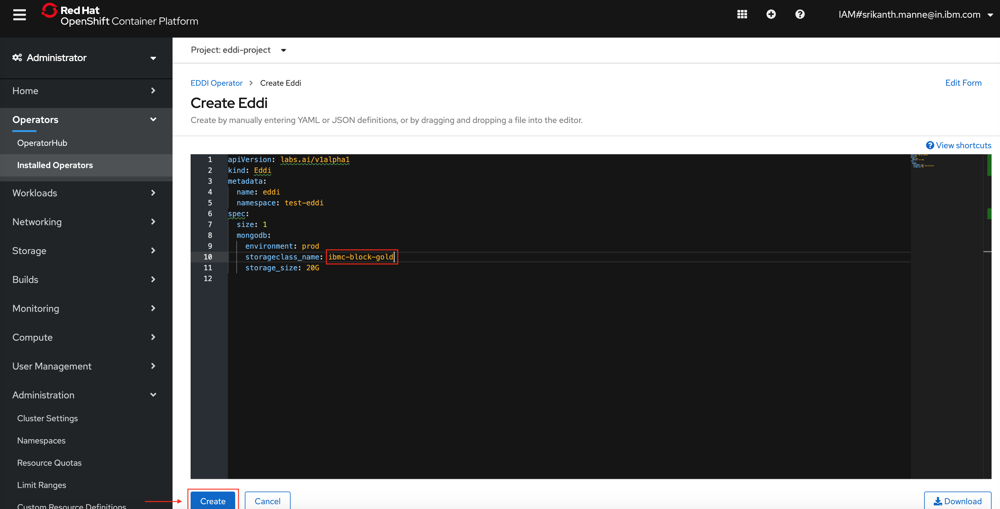

---
#Front matter (metadata).
abstract:               # REQUIRED

authors:
 - name: "Manoj Jahgirdar"
   email: "manoj.jahgirdar@in.ibm.com"
 - name: "Srikanth Manne"
   email: "srikanth.manne@in.ibm.com"
 - name: "Rahul Reddy Ravipally"
   email: "raravi86@in.ibm.com"
 - name: "Manjula G. Hosurmath"
   email: "mhosurma@in.ibm.com"

completed_date: 2020-01-20

components:
- slug: "eddi-operator"
  name: "E.D.D.I Operator"
  url: "https://marketplace.redhat.com/en-us/products/labsai"
  type: "component"
- slug: "redhat-marketplace"
  name: "Red Hat Marketplace"
  url: "https://marketplace.redhat.com/"
  type: "component"

draft: true|false       # REQUIRED

excerpt:                # REQUIRED

keywords:               # REQUIRED - comma separated list

last_updated:           # REQUIRED - Note: date format is YYYY-MM-DD

primary_tag:          # REQUIRED - Note: Choose only only one primary tag. Multiple primary tags will result in automation failure. Additional non-primary tags can be added below.

pta:                    # REQUIRED - Note: can be only one
# For a full list of options see https://github.ibm.com/IBMCode/Definitions/blob/master/primary-technology-area.yml
# Use the "slug" value found at the link above to include it in this content.
# Example (remove the # to uncomment):
 # - "cloud, container, and infrastructure"

pwg:                    # REQUIRED - Note: can be one or many
# For a full list of options see https://github.ibm.com/IBMCode/Definitions/blob/master/portfolio-working-group.yml
# Use the "slug" value found at the link above to include it in this content.
# Example (remove the # to uncomment):
# - "containers"

related_content:        # OPTIONAL - Note: zero or more related content
  - type: announcements|articles|blogs|patterns|series|tutorials|videos
    slug:

related_links:           # OPTIONAL - Note: zero or more related links
  - title:
    url:
    description:

series:                 # OPTIONAL
 - type:
   slug:

subtitle:  Use the E.D.D.I operator to build your chatbot
tags:
# Please select tags from the complete set of tags below. Do not create new tags. Only use tags specifically targeted for your content. If your content could match all tags (for example cloud, hybrid, and on-prem) then do not tag it with those tags. Less is more.
# For a full list of options see https://github.ibm.com/IBMCode/Definitions/blob/master/tags.yml
# Use the "slug" value found at the link above to include it in this content.
# Example (remove the # to uncomment):
 # - "blockchain"

title:  Build a COVID-19 infection risk-assessment chatbot

---

# Build a COVID-19 infection risk-assessment chatbot

As Covid-19 numbers continue to rise, you might wonder about your chance of contracting the virus. In this tutorial, learn how to build a chatbot that will assess your risk of getting infected with Covid-19 using the E.D.D.I Operator hosted on Red Hat Marketplace.

# About the E.D.D.I operator

E.D.D.I is an enterprise-ready chatbot platform that enables you to create and maintain customizable chatbots. It has a resource-oriented design and RESTful architecture which is easy to scale. A natural language processing parser matches user inputs as words and phrases and Behavior Rules assist in making decisions with predefined and custom conditions. [Learn more](https://marketplace.redhat.com/en-us/products/labsai).

# Learning objectives

After completing this tutorial, you will understand how to:

* Install the E.D.D.I Operator from Red Hat Marketplace on an OpenShift cluster
* Create an E.D.D.I chatbot instance
* Build a chatbot from scratch with the E.D.D.I operator

# Estimated time

Completing this tutorial should take about 30 minutes.

# Prerequisites

To complete the steps in this tutorial, you need the following installed:

1. [Red Hat Marketplace Account](https://marketplace.redhat.com/en-us/registration/om)
2. [Red Hat OpenShift Cluster](https://cloud.ibm.com/kubernetes/catalog/create?platformType=openshift)
3. [OC & kubectl CLI](https://docs.openshift.com/container-platform/3.6/cli_reference/get_started_cli.html)
4. [Postman](https://www.postman.com/)

## Steps

1. [Configure a Red Hat OpenShift Cluster with Red Hat Marketplace](#step-1-configure-a-red-hat-openshift-cluster-with-red-hat-marketplace)
1. [Deploy a E.D.D.I operator to an OpenShift cluster](#step-2-deploy-the-eddi-operator-to-an-openshift-cluster)
1. [Create an instance](#step-3-create-an-instance)
1. [Create a chatbot in E.D.D.I](#step-4-create-a-chatbot-in-eddi)

    1. [Create a regular dictionary](#step-41-create-a-regular-dictionary)
    2. [Create behavior rules](#step-42-create-behavior-rules)
    3. [Create output set](#step-43-create-output-sets)
    4. [Packaging](#step-44-packaging)
    5. [Create a chatbot](#step-45-create-a-chatbot)
    6. [Check the status of the deployment](#step-46-check-the-status-of-the-deployment)

1. [Access the E.D.D.I Dashboard to manage the chatbot](#step-5-access-the-eddi-dashboard-to-manage-the-chatbot)
1. [Explore the chatbot](#step-6-explore-the-chatbot)

## Step 1. Configure a Red Hat OpenShift Cluster with Red Hat Marketplace

Follow the steps in this tutorial to confirgure a Red Hat OpenShift cluster and connect to the cluster using your command line interface (CLI): [Configure a Red Hat OpenShift cluster hosted on Red Hat Marketplace](https://developer.ibm.com/tutorials/configure-a-red-hat-openshift-cluster-with-red-hat-marketplace).

## Step 2. Deploy the E.D.D.I operator to an OpenShift cluster

Follow these steps to deploy the E.D.D.I operator to an OpenShift cluster. 

1. Visit the [Red Hat Marketplace catalog](https://marketplace.redhat.com/en-us) and search for "E.D.D.I". Select `E.D.D.I` from the results as shown.

    

1. The E.D.D.I product page gives you an overview, documentation, and pricing options associated with the product. Click the **Free Trial** button.

    

1. Next, the purchase summary will show the `Subscription term` and total cost is $0.00. Click **Start trial**.

    

    > You can visit [Workspace > My Software](https://marketplace.redhat.com/en-us/workspace/software) to view your list of purchased software.

1. Back in the web dashboard, select the E.D.D.I tile and click the **Operators tab**. Select the **Install Operator** button. Leave the default selection for Update channel and Approval strategy. Select the cluster and namespace scope as `eddi-project` for the operator, and click **Install**.

    

1. You should see a message like the one below at the top of your screen, indicating the install process initiated in the cluster.

    

## Step 3: Create an instance

1. Log into your OpenShift cluster. From the left navigation, click **Operators** and select **Installed Operators** to confirm the installation was successful. You should see the E.D.D.I Operator listed under the project/namespace `eddi-project`.

    

1. On the E.D.D.I. operator screen, navigate to Provided APIs and select the first **Create Instance**.

    

1. The E.D.D.I page displays with the default YAML. Edit the `storageclass_name` in the YAML file and click on the **Create** button. If the default YAML file is not visiblie, you can copy paste the bellow YAML file replacing the `storageclass_name`.

    ```yaml
    apiVersion: labs.ai/v1alpha1
    kind: Eddi
    metadata:
      name: eddi
    spec:
      size: 1
      mongodb:
        environment: prod
        storageclass_name: <existing_storageclass>
        storage_size: 20G
    ```

    

    E.D.D.I Operator pods should come up when the installation is completed.

1. Under the left panel, select **Networking > Routes**. Make sure you are in the `eddi-project` namesapace. You should now see the `eddi-route` with a URL like the following: 

    

1. You can now visit the URL to access the E.D.D.I Dashboard.

    

## Step 4: Create a chatbot in E.D.D.I

Now, let's create a chatbot in E.D.D.I from scratch.

- To create a chatbot, you will have to complete these steps:

1. Create a regular dictionary
1. Create behavior rules
1. Create output sets
1. Package your dictionary, rules, and sets
1. Create a chatbot

- In order to build a Chatbot with E.D.D.I, you will have to create a few configuration files and POST them to the corresponding REST APIs. You can use tools like [Postman](https://www.postman.com/downloads/) to make the API calls.

### Step 4.1: Create a regular dictionary

*Regular dictionaries* are used store custom words and phrases in artifical intelligence systems.

- Make a `POST` to `<eddi-url>/regulardictionarystore/regulardictionaries` with a JSON file in the body as follows.

>Note: You will use the `<eddi-url>` generated in [step 1](#step-1-configure-a-red-hat-openshift-cluster-with-red-hat-marketplace).

- In Postman, enter the `<eddi-url>` followed by `/regulardictionarystore/regulardictionaries`. Make sure you select the following parameters:
    
   1. Select the request type to be `POST`
   2. Select `Body`
   3. Select `raw`
   4. Select type as `JSON`
   5. Copy and paste the JSON body given below
    ```json
    {
        "words": [
            {
                "word": "hello",
                "expressions": "greeting(hello)",
                "frequency": 0
            },
            {
                "word": "hi",
                "expressions": "greeting(hi)",
                "frequency": 0
            },
            {
                "word": "bye",
                "expressions": "goodbye(bye)",
                "frequency": 0
            },
            {
                "word": "take test",
                "expressions": "taketest(yes)",
                "frequency": 0
            },
            {
                "word": "thanks",
                "expressions": "thanks(thanks)",
                "frequency": 0
            }
        ],
        "regExs": [],
        "phrases": [
            {
                "phrase": "good afternoon",
                "expressions": "greeting(good_afternoon)"
            },
            {
                "phrase": "how are you",
                "expressions": "how_are_you"
            }
        ]
    }
    ```
   6. Click the **Send** button to make the request. If your request is sucessful, you will see a status: `201 Created` in your postman.
   7. Click on the `Headers` to view the response
   8. You can see a `Location` header with a URL something like `eddi://ai.labs.regulardictionary/regulardictionarystore/regulardictionaries/<UNIQUE_DICTIONARY_ID>?version=<UNIQUE_DICTIONARY_VERSION>`. Make a note of the `<UNIQUE_DICTIONARY_ID>` as shown. 

    

>Note: The `<UNIQUE_DICTIONARY_ID>` will be used to package the elements of the chatbot, so please make a note of it.

### Step 4.2: Create behavior rules

*Behavior rules* are are a series of defined rules by the developer of the bot. These rules are used to answer to the queries asked by the user.

- To create behavior rules, you will make a `POST` to `<eddi-url>/behaviorstore/behaviorsets` with a JSON file in the body as follows.

>Note: You will use the `<eddi-url>` generated in [step 1](#step-1-configure-a-red-hat-openshift-cluster-with-red-hat-marketplace).

- In Postman, enter the `<eddi-url>` followed by `/behaviorstore/behaviorsets`. Make sure you select the following parameters:
    
   1. Select the request type to be `POST`
   2. Select `Body`
   3. Select `raw`
   4. Select type as `JSON`
   5. Copy and paste the JSON body given below
    
    ```json
    {
        "behaviorGroups": [
            {
                "name": "Smalltalk",
                "behaviorRules": [
                    {
                        "name": "Welcome",
                        "actions": [
                            "welcome"
                        ],
                        "conditions": [
                            {
                                "type": "occurrence",
                                "configs": {
                                    "maxTimesOccurred": "0",
                                    "behaviorRuleName": "Welcome"
                                }
                            }
                        ]
                    },
                    {
                        "name": "Greeting",
                        "actions": [
                            "greet"
                        ],
                        "conditions": [
                            {
                                "type": "inputmatcher",
                                "configs": {
                                    "expressions": "greeting(*)",
                                    "occurrence": "currentStep"
                                }
                            }
                        ]
                    },
                    {
                        "name": "Taketest",
                        "actions": [
                            "taketest"
                        ],
                        "conditions": [
                            {
                                "type": "inputmatcher",
                                "configs": {
                                    "expressions": "taketest(*)",
                                    "occurrence": "currentStep"
                                }
                            }
                        ]
                    },
                    {
                        "name": "Symptom 1",
                        "actions": [
                            "symptomone",
                            "CONVERSATION_END"
                        ],
                        "conditions": [
                            {
                                "type": "inputmatcher",
                                "configs": {
                                    "expressions": "symptomone(*)",
                                    "occurrence": "currentStep"
                                }
                            }
                        ]
                    },
                    {
                        "name": "Safe",
                        "actions": [
                            "safe",
                            "CONVERSATION_END"
                        ],
                        "conditions": [
                            {
                                "type": "inputmatcher",
                                "configs": {
                                    "expressions": "safe(*)",
                                    "occurrence": "currentStep"
                                }
                            }
                        ]
                    },
                    {
                        "name": "Semi Safe",
                        "actions": [
                            "semisafe",
                            "CONVERSATION_END"
                        ],
                        "conditions": [
                            {
                                "type": "inputmatcher",
                                "configs": {
                                    "expressions": "semisafe(*)",
                                    "occurrence": "currentStep"
                                }
                            }
                        ]
                    },
                    {
                        "name": "Semi Risk",
                        "actions": [
                            "semirisk",
                            "CONVERSATION_END"
                        ],
                        "conditions": [
                            {
                                "type": "inputmatcher",
                                "configs": {
                                    "expressions": "semirisk(*)",
                                    "occurrence": "currentStep"
                                }
                            }
                        ]
                    },
                    {
                        "name": "Symptom 2",
                        "actions": [
                            "symptomtwo"
                        ],
                        "conditions": [
                            {
                                "type": "inputmatcher",
                                "configs": {
                                    "expressions": "symptomtwo(*)",
                                    "occurrence": "currentStep"
                                }
                            }
                        ]
                    },
                    {
                        "name": "Symptom 2a",
                        "actions": [
                            "symptomtwoa"
                       ],
                        "conditions": [
                            {
                                "type": "inputmatcher",
                                "configs": {
                                    "expressions": "symptomtwoa(*)",
                                    "occurrence": "currentStep"
                                }
                            }
                        ]
                    },
                    {
                        "name": "Symptom 2b",
                        "actions": [
                            "symptomtwob"
                        ],
                        "conditions": [
                            {
                                "type": "inputmatcher",
                                "configs": {
                                    "expressions": "symptomtwob(*)",
                                    "occurrence": "currentStep"
                                }
                            }
                        ]
                    },
                    {
                        "name": "Symptom 2c",
                        "actions": [
                            "symptomtwoc"
                        ],
                        "conditions": [
                            {
                                "type": "inputmatcher",
                                "configs": {
                                    "expressions": "symptomtwoc(*)",
                                    "occurrence": "currentStep"
                                }
                            }
                        ]
                    },
                    {
                        "name": "Symptom 3",
                        "actions": [
                            "symptomthree"
                        ],
                        "conditions": [
                            {
                                "type": "inputmatcher",
                                "configs": {
                                    "expressions": "symptomthree(*)",
                                    "occurrence": "currentStep"
                                }
                            }
                        ]
                    },
                    {
                        "name": "Goodbye",
                        "actions": [
                            "say_goodbye",
                            "CONVERSATION_END"
                        ],
                        "conditions": [
                            {
                                "type": "inputmatcher",
                                "configs": {
                                    "expressions": "goodbye(*)"
                                }
                            }
                        ]
                    },
                    {
                        "name": "Thank",
                        "actions": [
                            "thank"
                        ],
                        "conditions": [
                            {
                                "type": "inputmatcher",
                                "configs": {
                                    "expressions": "thank(*)"
                                }
                            }
                        ]
                    },
                    {
                        "name": "how are you",
                        "actions": [
                            "how_are_you"
                        ],
                        "conditions": [
                            {
                                "type": "inputmatcher",
                                "configs": {
                                    "expressions": "how_are_you"
                                }
                            }
                        ]
                    }
                ]
            }
        ]
    }
    ```
    
   6. Click the **Send** button to make the request. If your request is successful, you will see a status: `201 Created` in your postman.
   7. Click on the `Headers` to view the response.
   8. You can see a `Location` header with a URL something like `eddi://ai.labs.behavior/behaviorstore/behaviorsets/<UNIQUE_BEHAVIOR_ID>?version=<BEHAVIOR_VERSION>`. Make a note of the `<UNIQUE_BEHAVIOR_ID>` as shown. 

    

>Note: The `<UNIQUE_BEHAVIOR_ID>` will be used in Packaging, please make a note of it.

### Step 4.3: Create output sets

*Output* is defined to answer the users' request based on the results from the behavior rule execution.

- Make a `POST` to `<eddi-url>/outputstore/outputsets` with a JSON in the body as follows.

>Note: You will use the `<eddi-url>` generated in [step 1](#step-1-configure-a-red-hat-openshift-cluster-with-red-hat-marketplace).

- In Postman, enter the `<eddi-url>` followed by `/outputstore/outputsets`, make sure you select the following parameters:
    1. Select the request type to be `POST`
    2. Select `Body`
    3. Select `raw`
    4. Select type as `JSON`
    5. Copy and paste the JSON body given below
    
    ```json
    {
        "outputSet": [
            {
                "action": "welcome",
                "timesOccurred": 0,
                "outputs": [
                    {
                        "type": "text",
                        "valueAlternatives": [
                            "Hi!, I am COVID-19 Chatbot"
                        ]
                    },
                    {
                        "type": "text",
                        "valueAlternatives": [
                            "Visit https://www.mohfw.gov.in/ to get more information regarding COVID-19 in India"
                        ]
                    },
                    {
                        "type": "text",
                        "valueAlternatives": [
                            "I will assess you today!"
                        ]
                    }
                ],
                "quickReplies": [
                    {
                        "value": "Sounds Good!",
                        "expressions": "taketest(yes)"
                    },
                    {
                        "value": "No Thanks I'm Fine.",
                        "expressions": "goodbye(bye)"
                    }
                ]
            },
            {
                "action": "greet",
                "timesOccurred": 0,
                "outputs": [
                    {
                        "type": "text",
                        "valueAlternatives": [
                            "Hi there! Nice to meet up! :-)",
                            "Hey you!"
                        ]
                    }
                ],
                "quickReplies": []
            },
            {
                "action": "taketest",
                "timesOccurred": 0,
                "outputs": [
                    {
                        "type": "text",
                        "valueAlternatives": [
                            "Are you experiencing any of the following symptoms?"
                        ]
                    },
                    {
                        "type": "text",
                        "valueAlternatives": [
                            "• severe difficulty breathing (for example, struggling for each breath, speaking in single words) \n • severe chest pain \n • having a very hard time waking up \n • feeling confused \n • lost consciousness"
                        ]
                    }
                ],
                "quickReplies": [
                    {
                        "value": "YES",
                        "expressions": "symptomone(yes)"
                    },
                    {
                        "value": "NO",
                        "expressions": "symptomtwo(yes)"
                    }
                ]
            },
            {
                "action": "symptomone",
                "timesOccurred": 0,
                "outputs": [
                    {
                        "type": "text",
                        "valueAlternatives": [
                            "Self-assessment result: AT RISK!"
                        ]
                    },
                    {
                        "type": "text",
                        "valueAlternatives": [
                            "Please call 104 or 97456-97456 Immediately"
                        ]
                    }
                ],
                "quickReplies": []
            },
            {
                "action": "symptomtwo",
                "timesOccurred": 0,
                "outputs": [
                    {
                        "type": "text",
                        "valueAlternatives": [
                            "Are you experiencing any of the following symptoms (or a combination of these symptoms)?"
                        ]
                    },
                    {
                        "type": "text",
                        "valueAlternatives": [
                            "• fever \n • new cough \n • difficulty breathing (for example, struggling for each breath, cannot hold breath for more than 10 seconds)"
                        ]
                    }
                ],
                "quickReplies": [
                    {
                        "value": "YES",
                        "expressions": "symptomtwoa(yes)"
                    },
                    {
                        "value": "NO",
                        "expressions": "symptomthree(yes)"
                    }
                ]
            },
            {
                "action": "symptomtwoa",
                "timesOccurred": 0,
                "outputs": [
                    {
                        "type": "text",
                        "valueAlternatives": [
                            "Have you travelled outside of India in the last 1 Month?"
                        ]
                    }
                ],
                "quickReplies": [
                    {
                        "value": "YES",
                        "expressions": "semirisk(yes)"
                    },
                    {
                        "value": "NO",
                        "expressions": "symptomtwob(yes)"
                    }
                ]
            },
            {
                "action": "symptomtwob",
                "timesOccurred": 0,
                "outputs": [
                    {
                        "type": "text",
                        "valueAlternatives": [
                            "Does someone you are in close contact with have COVID-19 (for example, someone in your household or workplace)?"
                        ]
                    }
                ],
                "quickReplies": [
                    {
                        "value": "YES",
                        "expressions": "semirisk(yes)"
                    },
                    {
                        "value": "NO",
                        "expressions": "symptomtwoc(yes)"
                    }
                ]
            },
            {
                "action": "symptomtwoc",
                "timesOccurred": 0,
                "outputs": [
                    {
                        "type": "text",
                        "valueAlternatives": [
                            "Are you in close contact with a person who is sick with respiratory symptoms (for example, fever, cough or difficulty breathing) who recently travelled outside of India?"
                        ]
                    }
                ],
                "quickReplies": [
                    {
                        "value": "YES",
                        "expressions": "semirisk(yes)"
                    },
                    {
                        "value": "NO",
                        "expressions": "semisafe(yes)"
                    }
                ]
            },
            {
                "action": "symptomthree",
                "timesOccurred": 0,
                "outputs": [
                    {
                        "type": "text",
                        "valueAlternatives": [
                            "Are you experiencing any of the following symptoms (or a combination of these symptoms)?"
                        ]
                    },
                    {
                        "type": "text",
                        "valueAlternatives": [
                            "• muscle aches \n • fatigue \n • headache \n • sore throat \n • runny nose"
                        ]
                    }
                ],
                "quickReplies": [
                    {
                        "value": "YES",
                        "expressions": "symptomtwoa(yes)"
                    },
                    {
                        "value": "NO",
                        "expressions": "safe(yes)"
                    }
                ]
            },
            {
                "action": "safe",
                "timesOccurred": 1,
                "outputs": [
                    {
                        "type": "text",
                        "valueAlternatives": [
                            "Self-assessment result: SAFE"
                        ]
                    },
                    {
                        "type": "text",
                        "valueAlternatives": [
                            "It is unlikely that you have COVID-19."
                        ]
                    }
                ],
                "quickReplies": []
            },
            {
                "action": "semisafe",
                "timesOccurred": 1,
                "outputs": [
                    {
                        "type": "text",
                        "valueAlternatives": [
                            "Self-assessment result: MOSTLY SAFE"
                        ]
                    },
                    {
                        "type": "text",
                        "valueAlternatives": [
                            "It is unlikely that you have COVID-19 but you should self-isolate at home until you are symptom-free."
                        ]
                    }
                ],
                "quickReplies": []
            },
            {
                "action": "semirisk",
                "timesOccurred": 1,
                "outputs": [
                    {
                        "type": "text",
                        "valueAlternatives": [
                            "Self-assessment result: MOSTLY AT RISK"
                        ]
                    },
                    {
                        "type": "text",
                        "valueAlternatives": [
                            "Please seek clinical assessment for COVID-19 over the phone."
                        ]
                    }
                ],
                "quickReplies": []
            },
            {
                "action": "greet",
                "timesOccurred": 1,
                "outputs": [
                    {
                        "type": "text",
                        "valueAlternatives": [
                            "Did we already say hi ?! Well, twice is better than not at all! ;-)"
                        ]
                    }
                ],
                "quickReplies": []
            },
            {
                "action": "say_goodbye",
                "timesOccurred": 0,
                "outputs": [
                    {
                        "type": "text",
                        "valueAlternatives": [
                            "See you soon!"
                        ]
                    }
                ],
                "quickReplies": []
            },
            {
                "action": "thank",
                "timesOccurred": 0,
                "outputs": [
                    {
                        "type": "text",
                        "valueAlternatives": [
                            "Your Welcome!"
                        ]
                    }
                ],
                "quickReplies": []
            },
            {
                "action": "how_are_you",
                "timesOccurred": 0,
                "outputs": [
                    {
                        "type": "text",
                        "valueAlternatives": [
                            "Pretty good.. having lovely conversations all day long.. :-D"
                        ]
                    }
                ],
                "quickReplies": []
            }
        ]
    }
    ```
    
    6. Click the **Send** button to make request. On successful requests, you can see a status: `201 Created` in your Postman.
    7. Click on the `Headers` to view the response
    8. You can see a `Location` header with a URL something like `eddi://ai.labs.output/outputstore/outputsets/<UNIQUE_OUTPUTSET_ID>?version=<OUTPUTSET_VERSION>`. Make a note of the `<UNIQUE_OUTPUTSET_ID>` as shown. 

    

>Note: The `<UNIQUE_OUTPUTSET_ID>` will be used in Packaging, please make a note of it.

### Step 4.4: Packaging

Now that you've created the dictionary, behavior rules, and output sets, you should align them in the package.

- Make a `POST` to `<eddi-url>/packagestore/packages` with a JSON in the body as follows.

>Note: You will use the `<eddi-url>` generated in [step 1](#step-1-configure-a-red-hat-openshift-cluster-with-red-hat-marketplace).

- In Postman, enter the `<eddi-url>` followed by `/packagestore/packages`, make sure you select the following parameters:
    
   1. Select the request type to be `POST`
   2. Select `Body`
   3. Select `raw`
   4. Select type as `JSON`
   5. Copy and paste the JSON body given below replacing it with the `<UNIQUE_DICTIONARY_ID>`, `<UNIQUE_BEHAVIOR_ID>` and `<UNIQUE_OUTPUTSET_ID>` copied from step 2.1, step 2.2 and step 2.3
    ```json
    {
    "packageExtensions": [
        {
        "type": "eddi://ai.labs.parser",
        "extensions": {
            "dictionaries": [
            {
                "type": "eddi://ai.labs.parser.dictionaries.integer"
            },
            {
                "type": "eddi://ai.labs.parser.dictionaries.decimal"
            },
            {
                "type": "eddi://ai.labs.parser.dictionaries.punctuation"
            },
            {
                "type": "eddi://ai.labs.parser.dictionaries.email"
            },
            {
                "type": "eddi://ai.labs.parser.dictionaries.time"
            },
            {
                "type": "eddi://ai.labs.parser.dictionaries.ordinalNumber"
            },
            {
                "type": "eddi://ai.labs.parser.dictionaries.regular",
                "config": {
                "uri": "eddi://ai.labs.regulardictionary/regulardictionarystore/regulardictionaries/<UNIQUE_DICTIONARY_ID>?version=<DICTIONARY_VERSION>"
                }
            }
            ],
            "corrections": [
            {
                "type": "eddi://ai.labs.parser.corrections.stemming",
                "config": {
                "language": "english",
                "lookupIfKnown": "false"
                }
            },
            {
                "type": "eddi://ai.labs.parser.corrections.levenshtein",
                "config": {
                "distance": "2"
                }
            },
            {
                "type": "eddi://ai.labs.parser.corrections.mergedTerms"
            }
            ]
        },
        "config": {}
        },
        {
        "type": "eddi://ai.labs.behavior",
        "config": {
            "uri": "eddi://ai.labs.behavior/behaviorstore/behaviorsets/<UNIQUE_BEHAVIOR_ID>?version=<BEHAVIOR_VERSION>"
        }
        },
        {
        "type": "eddi://ai.labs.output",
        "config": {
            "uri": "eddi://ai.labs.output/outputstore/outputsets/<UNIQUE_OUTPUTSET_ID>?version=<OUTPUTSET_VERSION>"
        }
        }
    ]
    }
    ```  
    
    6. Click the **Send** button to make a request. If it succeeds, you should see a status: `201 Created` in your postman
    7. Click on the `Headers` to view the response
    8. You can see a `Location` header with a URL something like `eddi://ai.labs.package/packagestore/packages/<UNIQUE_PACKAGE_ID>?version=<PACKAGE_VERSION>`. 
    Make a note of the `<UNIQUE_PACKAGE_ID>` and `<PACKAGE_VERSION>` as shown.

    

>Note: The `<UNIQUE_PACKAGE_ID>` and `<PACKAGE_VERSION>` will be used in creating a Bot, please make a note of it.

### Step 4.5: Create a chatbot

Now it's time to build a chatbot that will use the different packages and channels.

- `POST` to `<eddi-url>/packagestore/packages` with a JSON file in the body as follows.

>Note: You will use the `<eddi-url>` generated in [step 1](#-step-1-configure-a-red-hat-openshift-cluster-with-red-hat-marketplace).

- In Postman, enter the `<eddi-url>` followed by `/packagestore/packages`, make sure you select the following parameters:
    
    1. Select the request type to be `POST`
    2. Select `Body`
    3. Select `raw`
    4. Select type as `JSON`
    5. Copy and paste the JSON body below, replacing it with the `<UNIQUE_PACKAGE_ID>` and `<PACKAGE_VERSION>` copied from step 2.4.  
    ```json
    {
    "packages": [
    "eddi://ai.labs.package/packagestore/packages/<UNIQUE_PACKAGE_ID>?version=<PACKAGE_VERSION>"
    ],
    "channels": []
    }
    ```
    6. Click the **Send** button to make the request. Once your request succeeds, you will see a status message that says: `201 Created` in your Postman.
    7. Click on the `Headers` to view the response.
    8. You can see a `Location` header with a URL. The URL will be similar to this: `eddi://ai.labs.bot/botstore/bots/<UNIQUE_BOT_ID>?version=<BOT_VERSION>`. Make a note of the `<UNIQUE_BOT_ID>` and `<BOT_VERSION>`.

    

>Note: The `<UNIQUE_BOT_ID>` and `<BOT_VERSION>` will be used to check the status of the Bot, please make a note of it.

### Step 4.6: Check the status of the deployment

- To check the deployment status of the chatbot, make a `GET` API call to `<eddi-url>/administration/unrestricted/deploymentstatus/<UNIQUE_BOT_ID>?version=<BOT_VERSION>`.

    

- You can expect a `NOT_FOUND`, `IN_PROGRESS`, `ERROR` and `READY` message to be returned in the body.

- As soon as the chatbot is deployed and has a `READY` status, you can invoke it and start using it.

## Step 5: Access the E.D.D.I Dashboard to manage the chatbot

To see the results of the commands you ran in the earlier steps, access the E.D.D.I dashboard using the URL you obtained in [step 1](#step-1-install-the-e.d.d.i-operator-from-red-hat-marketplace-on-openshift-cluster).

1. In the dashboard, click on **Go to Bot Manager** as shown.

    

1. In the Bot Manager in your E.D.D.I dashboard, you can see the Conversation ID of the chatbot that you deployed through API calls.

    

1. Rename the chatbot to avoid ambiguity. Click on the three-dot menu and select **Rename**.

    

1. Give the chatbot a meaningful name such as `Covid19 helth check chatbot` and save it.

    

1. Finally to interact with the chatbot, click **Open Chat**.

    
    
## Step 6: Explore the chatbot

- You can see the chatbot in action once you are in the chat window.
    
    

- The chatbot asks you a set of standard questions to assess your risk of getting infected to COVID-19. You can answer the questions to self assess yourself or share the link with your family and friends to help them take the assessment.

    

## Summary

We learn't how to create a chatbot with E.D.D.I Operator hosted on Red Hat Marketplace.

## Reference

You can refer the following documentation from [E.D.D.I labs](https://docs.labs.ai/) to learn more about the operator and its features.

- <https://docs.labs.ai/redhat-openshift>
